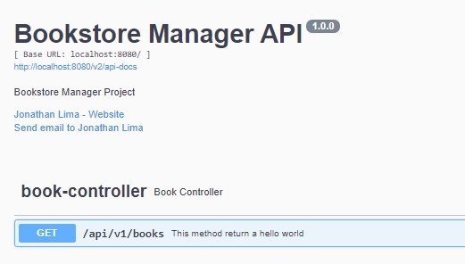

# Bookstore Manager

This Bookstore Manager project purpose is to deliver a REST API to a bookstore.

This project has been developed with Springboot and Kotlin. The package manager is Maven.

## Running the project

You can run the project by using the maven command

```shell
mvn spring-boot:run
```

## Development Process

- Setup project with Spring Initializr
- Add swagger (open-api v2) and configurations
- Add springdoc-openapi-ui (open-api v3) and configurations [Optional, this is most recent]

### OpenAPI v2.0 [Swagger/Springfox Configurations]

We need to add the springfox and springfox-swagger-ui.

```xml
<properties>
    <springfox.version>3.0.0</springfox.version>
</properties>
<dependencies>
<dependency>
    <groupId>io.springfox</groupId>
    <artifactId>springfox-boot-starter</artifactId>
    <version>${springfox.version}</version>
</dependency>
```

After that, we need to create a configuration class annotated with `@Configuration` and `@EnableSwagger2`. This
Configuration class should expose a `@Bean` that creates the swagger configuration/docket. such as:

```kotlin
@Configuration
@EnableSwagger2
class SwaggerConfig {
    @Bean
    fun api(): Docket {
        return Docket(DocumentationType.SWAGGER_2)
            .select()
            .apis(RequestHandlerSelectors.basePackage(BASE_PACKAGE))
            .paths(PathSelectors.any())
            .build()
            .apiInfo(buildApiInfo())
    }

    private fun buildApiInfo(): ApiInfo {

        return ApiInfoBuilder()
            .title(API_TITLE)
            .description(API_DESCRIPTION)
            .version(API_VERSION)
            .contact(Contact(CONTACT_NAME, CONTACT_EMAIL, CONTACT_URL))
            .build()
    }
}
```

Finally, we can annotate our Controller with the most descriptive data to our api. Bellow a few annotations we can use:
- `@ApiOperation("Describe here what this method does")`
- `@ApiResponses(value = [])`
```kotlin
@RestController
@RequestMapping("/api/v1/books")
class BookController {

    @ApiOperation("This method returns a hello world")
    @ApiResponses(value = [ApiResponse(code = 200, message = "Success method return")])
    @GetMapping
    fun hello(): ResponseEntity<String> {
        return ResponseEntity("Hello world!", HttpStatus.OK)
    }
}
```
This is the return when we access `localhost:8080/swagger-ui`

<p align="center">  </p>

### OpenAPI v3.0
- https://www.baeldung.com/spring-rest-openapi-documentation

# References

- [What is REST](https://www.codecademy.com/articles/what-is-rest)
- [REST and RESTFUL](https://becode.com.br/o-que-e-api-rest-e-restful/)
- [HTTP status codes](https://restfulapi.net/http-status-codes/)
- [RESTFUL status codes and practices](https://www.restapitutorial.com/lessons/httpmethods.html#:~:text=The%20primary%20or%20most%2Dcommonly,or%20CRUD)%20operations%2C%20respectively.)
- [Springboot Docs](https://docs.spring.io/spring-boot/docs/current/reference/html/index.html)
- [Springboot starters](https://docs.spring.io/spring-boot/docs/current/reference/htmlsingle/#using.build-systems.starters)