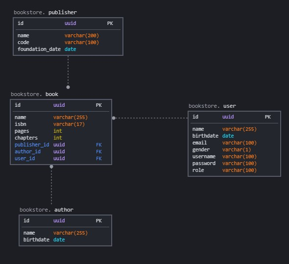

# Bookstore Manager
[](https://travis-ci.com/jlimadev/bookstore-manager)
[](https://sonarcloud.io/dashboard?id=jlimadev_bookstore-manager)

This Bookstore Manager project purpose is to deliver a REST API to a bookstore.

- This project has been developed with Springboot and Kotlin. The package manager is Gradle.
- This project uses TravisCI and Heroku for CI/CD
- This project has CI Integrated code analysis with SonarCloud

## Running the project

You can run the project by using the maven command

```shell
gradle bootRun
# OR
./gradlew bootRun
```

## Development Process

- Setup project with Spring Initializr
- Add swagger (open-api v3) and configurations
- Add springdoc-openapi-ui (open-api v3) and configurations [Optional, this is other provider]
- Configure Profiles
- Configure actuator
- Configure TravisCI
- Add KTLint
- Add Jacoco
- Configure SonarCloud with TravisCI
- Add Postgres database local (with docker-compose)
- Add Postgres database prod (with heroku)
- Add Liquibase to handle migrations
- Add H2 and Profile to CI process (no postgres and no liquibase)
- Enable Auditable Entities

### OpenAPI Configurations

we can configure OpenApi/swagger in multiple ways. In this project we have two configuration to it.

- [Springfox](docs/openapi/SpringfoxConfiguration.md)
- [Springdoc](docs/openapi/SpringdocConfiguration.md)

### Profiles

We can use multiple profiles in our application. Here is a document with more explanation.

- [Profiles](docs/ops/profiles.md)

### Actuator

We can monitor our service by using [Actuator](docs/ops/actuator.md)

### CI/CD

Following the best practices, we use CI/CD processes in this project. [Read more here](docs/ops/CICD.md). 

For CI, we use TravisCI and for CD, we use Heroku.

For [Code Analysis/Quality](docs/ops/quality.md) we use:
- SonarCloud to run analysis
- Test reporting with Jacoco
- Lint with KTLint

### Auditing

In order to track all changes, we have the implementation of auditing in this project.

[Docs on Auditing](docs/security/auditable-classes.md)

### Database Model

Database [configuration and explanation](docs/ops/database.md)

<p align="center"> </p>

### Rest Endpoints

- Authors
    - POST [/api/v1/authors]
    - GET (all) [/api/v1/authors]
    - GET (one) [/api/v1/authors/{name}]
    - PUT [/api/v1/authors/{id}]
    - DELETE [/api/v1/authors/{id}]
- Publishers
    - POST [/api/v1/publishers]
    - GET (all) [/api/v1/publishers]
    - GET (one) [/api/v1/publishers/{id}]
    - PUT [/api/v1/publishers/{id}]
    - DELETE [/api/v1/publishers/{id}]
- Users
    - POST [/api/v1/users]
    - POST [/authenticate]
    - GET (all) [/api/v1/users]
    - GET (one) [/api/v1/users/{id}]
    - PUT [/api/v1/users/{id}]
    - DELETE [/api/v1/users/{id}]
- Books
    - POST [/api/v1/books]
    - GET (all) [/api/v1/books]
    - GET (one) [/api/v1/books/{id}]
    - PUT [/api/v1/books/{id}]
    - DELETE [/api/v1/books/{id}]

# References

- [What is REST](https://www.codecademy.com/articles/what-is-rest)
- [REST and RESTFUL](https://becode.com.br/o-que-e-api-rest-e-restful/)
- [HTTP status codes](https://restfulapi.net/http-status-codes/)
- [RESTFUL status codes and practices](https://www.restapitutorial.com/lessons/httpmethods.html#:~:text=The%20primary%20or%20most%2Dcommonly,or%20CRUD)%20operations%2C%20respectively.)
- [Springboot Docs](https://docs.spring.io/spring-boot/docs/current/reference/html/index.html)
- [Springboot starters](https://docs.spring.io/spring-boot/docs/current/reference/htmlsingle/#using.build-systems.starters)