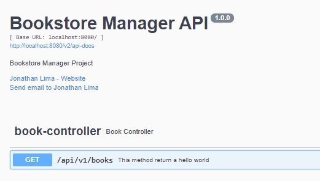

# OpenAPI v3.0 with Springfox Configurations

We need to add the springfox and springfox-swagger-ui.

```xml
<properties>
    <springfox.version>3.0.0</springfox.version>
</properties>
<dependencies>
<dependency>
    <groupId>io.springfox</groupId>
    <artifactId>springfox-boot-starter</artifactId>
    <version>${springfox.version}</version>
</dependency>
```

After that, we need to create a configuration class annotated with `@Configuration` and `@EnableSwagger2`. This
Configuration class should expose a `@Bean` that creates the swagger configuration/docket. such as:

```kotlin
@Configuration
@EnableSwagger2
@EnableOpenApi
class SwaggerConfig {
    @Bean
    fun api(): Docket {
        return Docket(DocumentationType.SWAGGER_2)
            .select()
            .apis(RequestHandlerSelectors.basePackage(BASE_PACKAGE))
            .paths(PathSelectors.any())
            .build()
            .apiInfo(buildApiInfo())
    }

    private fun buildApiInfo(): ApiInfo {
        return ApiInfoBuilder()
            .title(API_TITLE)
            .description(API_DESCRIPTION)
            .version(API_VERSION)
            .contact(Contact(CONTACT_NAME, CONTACT_EMAIL, CONTACT_URL))
            .build()
    }
}
```

Finally, we can annotate our Controller with the most descriptive data to our api. Bellow a few annotations we can use:

- `@ApiOperation("Describe here what this method does")`
- `@ApiResponses(value = [])`

```kotlin
import io.swagger.annotations.ApiOperation
import io.swagger.annotations.ApiResponse
import io.swagger.annotations.ApiResponses

@RestController
@RequestMapping("/api/v1/books")
class BookController {

    @ApiOperation("This method returns a hello world")
    @ApiResponses(value = [ApiResponse(code = 200, message = "Success method return")])
    @GetMapping
    fun hello(): ResponseEntity<String> {
        return ResponseEntity("Hello world!", HttpStatus.OK)
    }
}
```

This is the return when we access `localhost:8080/swagger-ui`

<p align="center">  </p>

If we are using `version 3+`, we also have access to openapi spec, by accessing:
``http://localhost:8080/v3/api-docs``.

This URL is Configurable on application.properties:
```properties
springfox.documentation.swagger-ui.base-url=/springfox/swagger-ui
springfox.documentation.swagger-ui.path=/springfox/swagger-ui
springfox.documentation.swagger.v2.path=/springfox/v2/api-docs
# http://localhost:8080/springfox/v2/api-docs
springfox.documentation.open-api.v3.path=/springfox/v3/api-docs
# http://localhost:8080/springfox/v3/api-docs
```